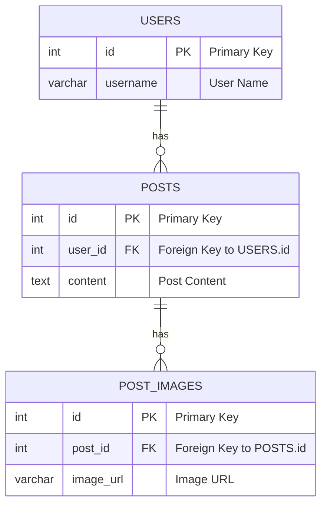

## データ構造



## 環境構築

### Databaseを起動

```shell
docker-compose up -d
```

## Migration

### Gooseのインストール

https://pressly.github.io/goose/installation/

```shell
go install github.com/pressly/goose/v3/cmd/goose@latest
```

### マイグレーションの作成

```shell
goose -dir db/migrations create create_user_table sql # or go
```

### マイグレーションの実行

```shell
goose -dir db/migrations mysql "root:password@tcp(localhost:3306)/sns?parseTime=true&loc=Asia%2FTokyo" up
```

## コード生成

### SQLBoilerをインストール

[volatiletech/sqlboiler #Download](https://github.com/volatiletech/sqlboiler?tab=readme-ov-file#download)

```shell
go install github.com/volatiletech/sqlboiler/v4@latest
go install github.com/volatiletech/sqlboiler/v4/drivers/sqlboiler-mysql@latest
````

### SQLBoilerでモデルコードの生成

```shell
sqlboiler mysql 
```