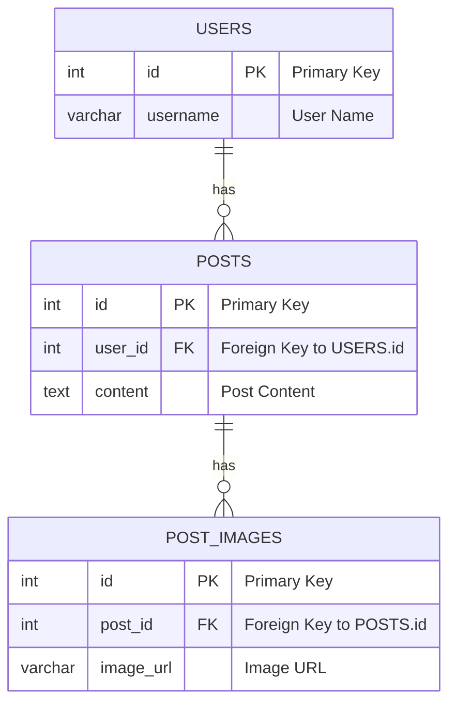

## データ構造



## 環境構築

### Databaseを起動

```shell
docker-compose up -d
```

## Migration

### Gooseのインストール

https://pressly.github.io/goose/installation/

```shell
go install github.com/pressly/goose/v3/cmd/goose@latest
```

### マイグレーションの作成

```shell
goose -dir db/migrations create create_user_table sql # or go
```

### マイグレーションの実行

```shell
goose -dir db/migrations mysql "root:password@tcp(localhost:3306)/sns?parseTime=true&loc=Asia%2FTokyo" up
```

## コード生成

### SQLBoilerをインストール

[volatiletech/sqlboiler #Download](https://github.com/volatiletech/sqlboiler?tab=readme-ov-file#download)

```shell
go install github.com/volatiletech/sqlboiler/v4@latest
go install github.com/volatiletech/sqlboiler/v4/drivers/sqlboiler-mysql@latest
````

### SQLBoilerの拡張テンプレートを追加

デフォルトのSQLBoilerにはBulk操作を行うための関数が含まれていないため、拡張テンプレートを追加する必要があります。

```shell
git submodule add --name "db/extensions"  https://github.com/tiendc/sqlboiler-extensions.git "db/extensions"
git submodule update --init
```

### SQLBoilerでモデルコードの生成

```shell
cp db/sqlboiler.toml sqlboiler.toml && sed -i -e "s|<GOPATH>|$(go env GOPATH)|g" sqlboiler.toml
sqlboiler mysql 
```

## ベンチマーク

### JOIN vs Eager Loading

| データ(ユーザー数, 投稿数, 画像数) | クエリ                    | JOIN[ms]   | Eager Loading[ms] | 
|----------------------|------------------------|------------|-------------------|
| (1000, 100, 2)       | `where 100 < id < 200` | 102.932854 | 269.216845        |
| (10000, 100, 2)      | `where 100 < id < 200` | 107.57667  | 299.383243        |
